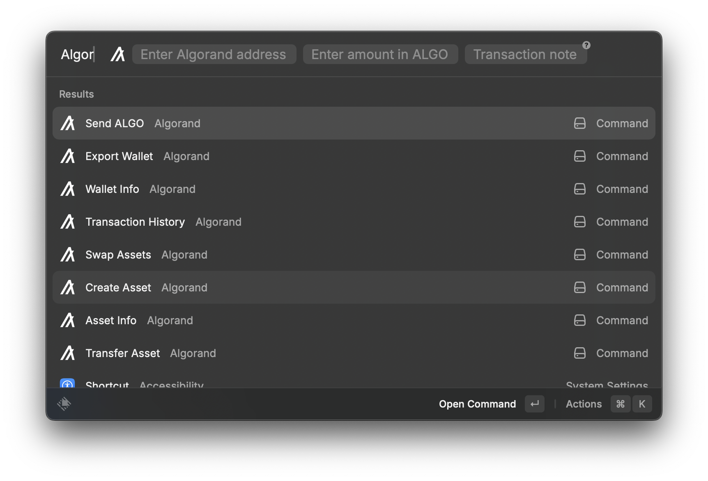

# Algorand MCP Server v0.1.1


A comprehensive Model Context Protocol (MCP) server providing 50+ tools for Algorand blockchain development, including account management, asset operations, smart contracts, API integration, swap functionality, and advanced transaction capabilities.

> **⭐ New in v0.1**: Added swap functionality with Pera Swap integration and a complete Raycast extension for native macOS integration!

## 🎥 Project Demo

<!-- markdownlint-disable MD033 -->
<div align="center">
  <iframe
    width="560"
    height="315"
    src="https://www.youtube.com/embed/2MtLTSmOi5Y"
    title="Algorand MCP - Project Demo"
    frameborder="0"
    allow="accelerometer; autoplay; clipboard-write; encrypted-media; gyroscope; picture-in-picture; web-share"
    allowfullscreen>
  </iframe>
</div>
<!-- markdownlint-enable MD033 -->

If the player doesn't load on GitHub, watch here: [https://youtu.be/2MtLTSmOi5Y](https://youtu.be/2MtLTSmOi5Y)

## 🚀 What's Included

This repository contains two powerful tools for Algorand development:

1. **🤖 MCP Server** - AI assistant integration with 50+ blockchain tools
2. **⚡ Raycast Extension** - Native macOS toolbar integration for Algorand operations



## Overview

This MCP server provides a complete suite of tools for AI assistants to interact with the Algorand blockchain, from basic operations to advanced smart contract development and deployment.

### 🤖 MCP Server Tool Categories

- **Basic Tools** (4 tools): Echo, calculations, time, testnet funding
- **Core Algorand Tools** (8 tools): Account generation, payments, assets, transactions
- **Swap Tools** (5 tools): **NEW!** Asset swapping with Pera Swap integration
- **Utility Tools** (10 tools): Address validation, encoding, TEAL compilation, cryptography
- **API Integration Tools** (12 tools): Algod, Indexer, and NFD API access
- **Advanced Transaction Tools** (8 tools): Atomic groups, smart contracts, key registration
- **ARC-26 Tools** (2 tools): URI generation and QR codes
- **Knowledge Tools** (4 tools): Semantic search through Algorand documentation
- **Wallet Management** (2 tools): Secure wallet storage and retrieval

**Total: 55+ tools** for comprehensive Algorand development

### ⚡ Raycast Extension Features

- **🔐 Wallet Management**: Secure wallet creation and management
- **💸 Transactions**: Send ALGO and transfer assets with ease
- **🔄 Asset Swapping**: **NEW!** DEX aggregation with real-time quotes
- **🪙 Asset Operations**: Create and manage ASAs (tokens)
- **📊 Portfolio View**: Detailed asset holdings and balances
- **⚡ Quick Actions**: Keyboard shortcuts for all operations
- **🔗 Explorer Integration**: Direct links to AlgoExplorer

## Architecture


## Security Features

### Mnemonic Phrase Protection

- **Encryption**: Built-in AES-256-GCM encryption for mnemonic phrases
- **Secure Storage**: Methods for encrypting/decrypting wallet credentials
- **Memory Safety**: Sensitive data is handled securely and not logged

### Network Configuration

- **Testnet Default**: Safely defaults to Algorand testnet
- **Environment-based**: Network configuration through environment variables
- **Production Ready**: Supports mainnet for production use

## Prerequisites

- Node.js 18+
- npm or yarn
- TypeScript
- Algorand testnet account (for testing)

## 🛠️ Installation

### MCP Server Setup

1. **Clone or download** this project
2. **Install dependencies**:
   ```bash
   npm install
   ```
3. **Create environment configuration**:

   ```bash
   # Create .env file with the following variables:
   ALGORAND_NETWORK=testnet
   ALGORAND_TOKEN=your_api_token
   ALGORAND_ALGOD=https://testnet-api.algonode.cloud
   ALGORAND_INDEXER=https://testnet-idx.algonode.cloud
   NFD_API_URL=https://api.nf.domains
   
   # Optional: For semantic search features
   QDRANT_URL=your_qdrant_url
   QDRANT_API_KEY=your_qdrant_api_key
   OPENAI_API_KEY=your_openai_api_key
   ```

4. **Build the project**:
   ```bash
   npm run build
   ```

### Raycast Extension Setup

1. **Navigate to the extension**:
   ```bash
   cd raycast/algorand
   npm install
   npm run build
   ```
2. **Import into Raycast**:
   - Open Raycast → Extensions → Import Extension
   - Select the `raycast/algorand` folder
   - Start using Algorand commands from your toolbar!

📖 **Detailed setup guides**: See [Raycast README](raycast/algorand/README.md) for complete instructions.

## Usage

### Running the Server

```bash
# Start the MCP server
npm start
```

### Development Mode

For development with automatic rebuilding:

```bash
# Build and run in development mode
npm run dev
```

### Testing

```bash
# Test the server functionality
npm test
```

For manual testing of individual tools, see:

- [TEST_QUERIES.md](TEST_QUERIES.md) - Markdown format with detailed descriptions
- [TEST_QUERIES.txt](TEST_QUERIES.txt) - Plain text format for easy copy-paste

Both files contain comprehensive test queries for all 47+ tools.

### MCP Client Configuration

#### For VSCode with MCP Extension

Add to your VSCode settings:

```json
{
  "mcpServers": {
    "algorand-mcp-server": {
      "command": "node",
      "args": ["path/to/your/project/dist/index.js"]
    }
  }
}
```

#### For Claude Desktop

Add to your Claude Desktop configuration:

```json
{
  "mcpServers": {
    "algorand-mcp-server": {
      "command": "node",
      "args": ["path/to/your/project/dist/index.js"]
    }
  }
}
```

#### For Cursor IDE

Add to your Cursor settings (Cursor > Preferences > Features > Model Context Protocol):

```json
{
  "mcpServers": {
    "algorand-mcp-server": {
      "command": "node",
      "args": ["path/to/your/project/dist/index.js"],
      "env": {
        "ALGORAND_NETWORK": "testnet",
        "ALGORAND_TOKEN": "your_api_token",
        "ALGORAND_ALGOD": "https://testnet-api.algonode.cloud",
        "ALGORAND_INDEXER": "https://testnet-idx.algonode.cloud",
        "NFD_API_URL": "https://api.nf.domains"
      }
    }
  }
}
```

**Note**: Replace `path/to/your/project/dist/index.js` with the actual path to your compiled server file.

#### Cursor IDE Usage Tips

1. **Environment Variables**: The `env` section in the Cursor configuration allows you to set environment variables directly in the MCP server configuration.

2. **Restart Required**: After updating the MCP configuration in Cursor, restart the application for changes to take effect.

3. **Debugging**: Use the Cursor developer tools to monitor MCP server communication and troubleshoot any issues.

4. **Tool Discovery**: Once configured, you can access all 47+ Algorand tools directly through Cursor's AI assistant interface.

### For VS Code Debugging

The project includes a `.vscode/mcp.json` configuration file for debugging within VS Code. You can use this with the MCP extension for VS Code.

## Available Tools

### Basic Tools (4 tools)

- **echo**: Echo back the provided message
- **calculate**: Perform basic mathematical calculations  
- **get_current_time**: Get the current time in a specified timezone
- **fund_testnet**: Fund an Algorand testnet account using the official faucet

### Core Algorand Tools (8 tools)

- **generate_algorand_account**: Generate a new Algorand account with address and mnemonic
- **get_account_info**: Get account information including balance and assets
- **send_payment**: Send Algo payment transaction (WARNING: Requires mnemonic phrase)
- **create_asset**: Create a new Algorand Standard Asset (ASA)
- **opt_in_to_asset**: Opt into an Algorand Standard Asset
- **transfer_asset**: Transfer an Algorand Standard Asset
- **get_asset_info**: Get information about an Algorand Standard Asset
- **get_transaction**: Get transaction details by transaction ID

### Wallet Management (2 tools)

- **store_wallet**: Securely store a wallet with encrypted mnemonic
- **load_wallet**: Load a stored wallet and return the address

### Utility Tools (10 tools)

- **validate_address**: Check if an Algorand address is valid
- **encode_address**: Encode a public key to an Algorand address
- **decode_address**: Decode an Algorand address to a public key
- **get_application_address**: Get the address for a given application ID
- **verify_bytes**: Verify a signature against bytes with an Algorand address
- **sign_bytes**: Sign bytes with a secret key
- **compile_teal**: Compile TEAL source code to bytecode
- **disassemble_teal**: Disassemble TEAL bytecode into source code
- **encode_obj**: Encode an object to msgpack format
- **decode_obj**: Decode msgpack bytes to an object

### API Integration Tools (12 tools)

#### Algod API (5 tools)

- **algod_get_account_info**: Get current account balance, assets, and auth address from algod
- **algod_get_transaction_info**: Get transaction details by transaction ID from algod
- **algod_get_asset_info**: Get asset details from algod
- **algod_get_application_info**: Get application details from algod
- **algod_get_pending_transactions**: Get pending transactions from algod mempool

#### Indexer API (5 tools)

- **indexer_lookup_account_by_id**: Get account information from indexer
- **indexer_lookup_asset_by_id**: Get asset information from indexer
- **indexer_lookup_transaction_by_id**: Get transaction details from indexer
- **indexer_search_for_accounts**: Search for accounts with various criteria
- **indexer_search_for_transactions**: Search for transactions with various criteria

#### NFD API (3 tools)

- **nfd_get_nfd**: Get NFD domain information by name
- **nfd_get_nfds_for_address**: Get all NFD domains owned by an address
- **nfd_search_nfds**: Search for NFD domains

### Advanced Transaction Tools (8 tools)

- **create_atomic_group**: Create an atomic transaction group from multiple transactions
- **sign_atomic_group**: Sign an atomic transaction group
- **submit_atomic_group**: Submit a signed atomic transaction group to the network
- **create_application**: Create a new smart contract application on Algorand
- **call_application**: Call a smart contract application on Algorand
- **optin_application**: Opt-in to an Algorand application
- **closeout_application**: Close out from an Algorand application
- **create_key_registration_transaction**: Create a key registration transaction for participation
- **freeze_asset**: Freeze or unfreeze an asset for an account

### ARC-26 Tools (2 tools)

- **generate_algorand_uri**: Generate a URI following the Algorand ARC-26 specification
- **generate_algorand_qrcode**: Generate a URI and QRCode following the Algorand ARC-26 specification

### Knowledge Tools (1 tool)

- **search_algorand_docs**: Semantic search through Algorand documentation using AI embeddings

## Project Structure

```text
├── src/
│   ├── index.ts                    # Main server implementation
│   ├── algorand.ts                 # Core Algorand blockchain operations
│   ├── utilityTools.ts             # Address validation, encoding, TEAL compilation
│   ├── apiTools.ts                 # Algod, Indexer, and NFD API integration
│   ├── advancedTransactionTools.ts # Atomic groups, smart contracts, key registration
│   ├── arc26Tools.ts              # ARC-26 URI generation and QR codes
│   └── knowledgeTools.ts           # Semantic search and documentation access
├── dist/                          # Compiled JavaScript output
├── .vscode/
│   └── mcp.json                   # VS Code MCP configuration
├── .github/
│   └── copilot-instructions.md    # GitHub Copilot instructions
├── package.json                   # Node.js package configuration (v3.0.0)
├── tsconfig.json                  # TypeScript configuration
├── ENHANCED_FEATURES.md           # Detailed feature documentation
├── MCP_SETUP.md                   # MCP server setup instructions
├── TESTING.md                     # Testing guidelines
├── TEST_QUERIES.md                # Manual testing queries for all tools (markdown)
├── TEST_QUERIES.txt               # Manual testing queries for all tools (plain text)
└── README.md                      # This file
```

## Development Guide

### Modular Architecture

The server is organized into modular tool categories:

- **`algorand.ts`**: Core blockchain operations (accounts, payments, assets)
- **`utilityTools.ts`**: Address validation, encoding, TEAL compilation
- **`apiTools.ts`**: Algod, Indexer, and NFD API integration
- **`advancedTransactionTools.ts`**: Atomic groups, smart contracts, key registration
- **`arc26Tools.ts`**: ARC-26 URI generation and QR codes
- **`knowledgeTools.ts`**: Semantic search and documentation access

### Adding New Tools

1. **Choose the appropriate module** for your tool category
2. **Define the tool schema** in the module's tools array
3. **Create a Zod schema** for input validation
4. **Implement the service method** in the corresponding service class
5. **Add the tool handler** in `index.ts`
6. **Update the module exports** to include the new tool

### Example Tool Implementation

```typescript
// In utilityTools.ts
export const MyTool = {
  name: 'my_tool',
  description: 'Description of what the tool does',
  inputSchema: {
    type: 'object' as const,
    properties: {
      input: {
        type: 'string',
        description: 'Input parameter description',
      },
    },
    required: ['input'],
  },
};

// Add to UtilityTools array
export const UtilityTools = [
  // ... existing tools
  MyTool,
];

// In utilityTools.ts service class
async myToolMethod(input: string): Promise<{ result: string }> {
  // Implement tool logic here
  return { result: `Processed: ${input}` };
}

// In index.ts
case 'my_tool': {
  const parsed = z.object({ input: z.string() }).parse(args);
  const result = await utilityService.myToolMethod(parsed.input);
  return {
    content: [
      {
        type: 'text',
        text: `Result: ${result.result}`,
      },
    ],
  };
}
```

## 🆕 What's New in v3.0

### 🔄 Swap Functionality
- **DEX Aggregation**: Powered by Pera Swap SDK for best prices
- **Multi-DEX Support**: Tinyman, Vestige, and more DEXs
- **Real-time Quotes**: Live pricing with slippage control
- **Secure Execution**: Client-side transaction signing
- **5 New MCP Tools**: Complete swap workflow integration

### ⚡ Raycast Extension
- **Native macOS Integration**: Access Algorand from your toolbar
- **Beautiful UI**: Native Raycast components with rich formatting
- **Keyboard Shortcuts**: Quick actions for power users
- **Secure Storage**: Encrypted wallet management
- **Portfolio View**: Detailed asset holdings and balances

### 🛠️ Enhanced Developer Experience
- **TypeScript Support**: Full type safety across all tools
- **Better Error Handling**: More descriptive error messages
- **Documentation Search**: Semantic search through Algorand docs
- **Asset Discovery**: Search and explore available tokens

## Security Considerations

- **Input Validation**: All tools use Zod schemas for robust input validation
- **Mnemonic Protection**: Built-in AES-256-GCM encryption for wallet storage
- **Network Safety**: Defaults to testnet for safe development
- **Error Handling**: Comprehensive error handling prevents sensitive data leakage
- **Memory Safety**: Sensitive data is handled securely and not logged
- **Production Ready**: Supports mainnet with proper environment configuration

### Security Best Practices

- Never commit mnemonic phrases or private keys to version control
- Use environment variables for sensitive configuration
- Test thoroughly on testnet before mainnet deployment
- Implement proper access controls in production
- Monitor for unusual activity and implement rate limiting

## Contributing

1. Fork the repository
2. Create a feature branch
3. Implement your changes with proper tests
4. Submit a pull request

## License

ISC License - see package.json for details

## Key Features

### 🔐 Security First

- AES-256-GCM encryption for wallet storage
- Comprehensive input validation with Zod schemas
- Testnet-first approach for safe development
- Production-ready mainnet support

### 🚀 Comprehensive Tool Suite

- **47+ tools** covering all aspects of Algorand development
- Modular architecture for easy maintenance and extension
- Real-time blockchain interaction capabilities
- Advanced smart contract deployment and management

### 🔗 Full API Integration

- Direct Algod API access for real-time data
- Indexer API for advanced search and analytics
- NFD (Name Service) integration for human-readable addresses
- Semantic search through Algorand documentation

### 🛠️ Developer Experience

- TypeScript for type safety and better development experience
- Comprehensive error handling and logging
- Easy-to-use MCP client configuration
- Extensive documentation and examples

### 📱 Modern Standards

- ARC-26 compliant URI generation
- QR code generation for mobile wallet integration
- Atomic transaction groups for complex operations
- Smart contract deployment and interaction

## Resources

- [Model Context Protocol Documentation](https://modelcontextprotocol.io/)
- [MCP SDK Reference](https://github.com/modelcontextprotocol/typescript-sdk)
- [Algorand Developer Portal](https://developer.algorand.org/)
- [Algorand SDK Documentation](https://algorand.github.io/js-algorand-sdk/)
- [ARC-26 Specification](https://github.com/algorandfoundation/ARCs/blob/main/ARCs/arc-0026.md)
